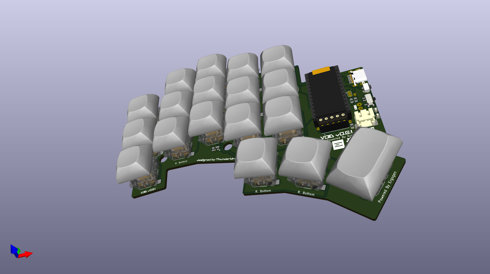
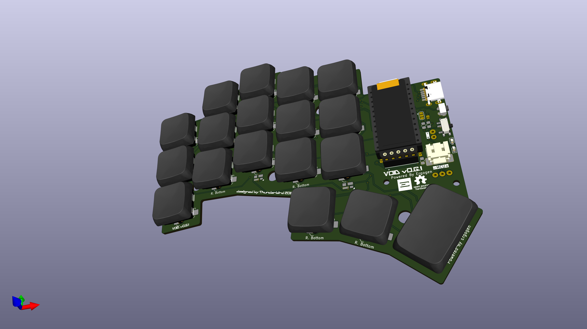
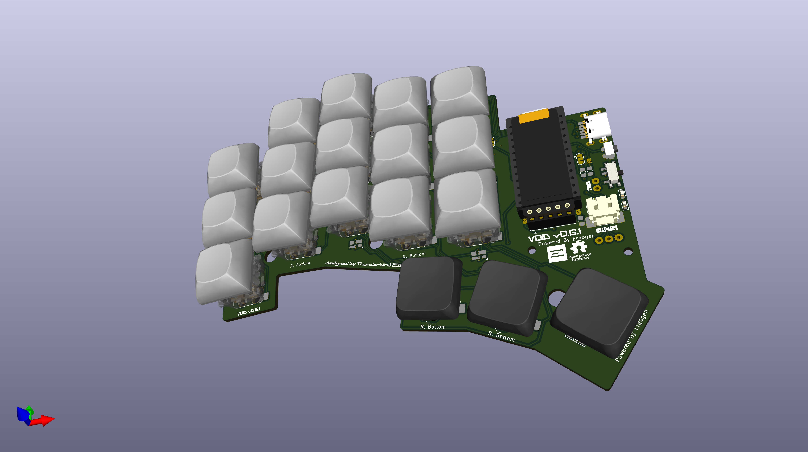

# VOID
## An Ergonomic 3x5 Split Keyboard

The VOID keyboard is meticulously designed to offer an ergonomic typing experience with its compact 3x5 layout. It supports a variety of switch types, including CherryMX, Choc V1/V2, and a hybrid configuration.

Similar to the [uniCorne](https://github.com/Thunderbird2086/uniCorne), the VOID keyboard features controller compatibility, hardware handedness, and Nice!View integration. Additionally, for communication between each side in wired keyboards using PR2040/ProMicro, it uses a USB Type-C connector instead of TRRS to avoid short circuit issues that can damage MCUs.

The pinky column is slightly splayed while the others are column staggered. For wireless keyboards, the VOID has a power connector to the MCU and an onboard pogo pin connector to the charger board, which can be directly connected to a battery.

## Images

## BuLd guide
TODO